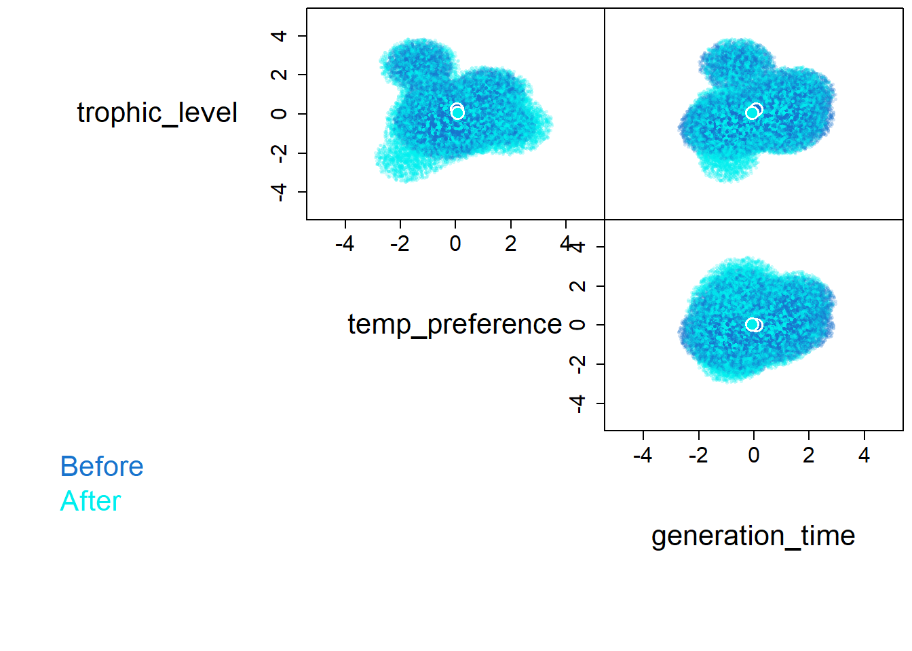

## Getting to know the basics 

This workshop discusses working with community trait data by introducing the `hypervolume` package by going over how to prepare the data and how to build hypervolumes in multiple ways.\

R script: [github](https://github.com/BSC6926-B52-Fall2023/workshopScripts/blob/main/workshop9.R)

[R script of workshop 9](workshopScripts/workshop9.R)

[abundance data](https://github.com/BSC6926-B52-Fall2023/workshopScripts/blob/main/data/abundHermine.csv)

[trait data](https://github.com/BSC6926-B52-Fall2023/workshopScripts/blob/main/data/fishTraits.csv)

## Hypervolumes 
Hypervolumes are a multidimensional tool that is based on Hutchinson's *n*-dimensional niche concept and we can build them with the `hypervolume` package. 

### Preparing the data
Typically we have a dataset that has the abundance of the community and another that has trait data. Therefore we need to combine them. Also, we can't have `NAs`, so we have to filter any missing data one we combine the datasets. 


::: {.cell}

```{.r .cell-code}
library(tidyverse)
# abundance data
ab = read_csv('data/abundHermine.csv')
## Rows: 68 Columns: 5
## ── Column specification ────────────────────────────────────────────────────────
## Delimiter: ","
## chr (4): site, species, hur, period
## dbl (1): abund
## 
## ℹ Use `spec()` to retrieve the full column specification for this data.
## ℹ Specify the column types or set `show_col_types = FALSE` to quiet this message.

# trait data
tr = read_csv('data/fishTraits.csv')
## Rows: 46 Columns: 7
## ── Column specification ────────────────────────────────────────────────────────
## Delimiter: ","
## chr (4): species, project, Class, Order
## dbl (3): trophic_level, temp_preference, generation_time
## 
## ℹ Use `spec()` to retrieve the full column specification for this data.
## ℹ Specify the column types or set `show_col_types = FALSE` to quiet this message.

# combine
df = left_join(ab, tr, by = 'species') |> 
  drop_na()

```
:::


Now we can make the hypervolume by selecting the data to be included and z-scoring


::: {.cell}

```{.r .cell-code}
df_before = df |> 
  filter(period == 'Before') |> 
  select(trophic_level, temp_preference, generation_time)|> 
  mutate(across(trophic_level:generation_time, scale))

```
:::


### Building hypervolumes
With a nested dataset of our columns that we want to build hypervolumes for we can use `mutate()` and `map()` to generate the hypervolume. 


::: {.cell}

```{.r .cell-code}
library(hypervolume)
## Loading required package: Rcpp

hv_before = hypervolume_gaussian(df_before, name = 'Before',
                                              samples.per.point = 1000,
                                              kde.bandwidth = estimate_bandwidth(df_before), 
                                              sd.count = 3, 
                                              quantile.requested = 0.95, 
                                              quantile.requested.type = "probability", 
                                              chunk.size = 1000, 
                                              verbose = F)
## Note that the formula used for the Silverman estimator differs in version 3 compared to prior versions of this package.
## Use method='silverman-1d' to replicate prior behavior.

hv_before
## ***** Object of class Hypervolume *****
## Name: Before
## Method: Gaussian kernel density estimate
## Number of data points (after weighting): 23
## Dimensionality: 3
## Volume: 78.068034
## Random point density: 171.606729
## Number of random points: 13397
## Random point values:
## 	min: 0.000
## 	mean: 0.001
## 	median: 0.000
## 	max:0.003
## Parameters:
## 	kde.bandwidth: 0.6189038 0.6189038 0.6189038
## 	kde.method: silverman
## 	samples.per.point: 1000
## 	sd.count: 3
## 	quantile.requested: 0.95
## 	quantile.requested.type: probability
```
:::


This can also be done to multiple at the same time with nest().


::: {.cell}

```{.r .cell-code}
df = df |> 
  select(period, trophic_level, temp_preference, generation_time) |> 
  mutate(across(trophic_level:generation_time, scale)) |> 
  group_by(period) |> 
  nest()

df
## # A tibble: 2 × 2
## # Groups:   period [2]
##   period data             
##   <chr>  <list>           
## 1 Before <tibble [23 × 3]>
## 2 After  <tibble [25 × 3]>

df = df |> 
  mutate(hv = map(data, \(data) hypervolume_gaussian(data, name = period,
                                              samples.per.point = 1000,
                                              kde.bandwidth = estimate_bandwidth(data), 
                                              sd.count = 3, 
                                              quantile.requested = 0.95, 
                                              quantile.requested.type = "probability", 
                                              chunk.size = 1000, 
                                              verbose = F)))
## Note that the formula used for the Silverman estimator differs in version 3 compared to prior versions of this package.
## Use method='silverman-1d' to replicate prior behavior.
## Note that the formula used for the Silverman estimator differs in version 3 compared to prior versions of this package.
## Use method='silverman-1d' to replicate prior behavior.

head(df)
## # A tibble: 2 × 3
## # Groups:   period [2]
##   period data              hv        
##   <chr>  <list>            <list>    
## 1 Before <tibble [23 × 3]> <Hypervlm>
## 2 After  <tibble [25 × 3]> <Hypervlm>
df$hv
## [[1]]
## ***** Object of class Hypervolume *****
## Name: Before
## Method: Gaussian kernel density estimate
## Number of data points (after weighting): 23
## Dimensionality: 3
## Volume: 70.900748
## Random point density: 188.883762
## Number of random points: 13392
## Random point values:
## 	min: 0.000
## 	mean: 0.001
## 	median: 0.000
## 	max:0.004
## Parameters:
## 	kde.bandwidth: 0.5996196 0.5570341 0.6430513
## 	kde.method: silverman
## 	samples.per.point: 1000
## 	sd.count: 3
## 	quantile.requested: 0.95
## 	quantile.requested.type: probability
## 
## [[2]]
## ***** Object of class Hypervolume *****
## Name: After
## Method: Gaussian kernel density estimate
## Number of data points (after weighting): 25
## Dimensionality: 3
## Volume: 90.256157
## Random point density: 160.354712
## Number of random points: 14473
## Random point values:
## 	min: 0.000
## 	mean: 0.000
## 	median: 0.000
## 	max:0.002
## Parameters:
## 	kde.bandwidth: 0.6391039 0.6706801 0.5990887
## 	kde.method: silverman
## 	samples.per.point: 1000
## 	sd.count: 3
## 	quantile.requested: 0.95
## 	quantile.requested.type: probability
```
:::


### plotting hypervolumes 
We can plot multiple hypervolumes by joining them together 


::: {.cell}

```{.r .cell-code}
hvj = hypervolume_join(df$hv[[1]], df$hv[[2]])

plot(hvj, pairplot = T, colors=c('dodgerblue3','cyan2'),
     show.3d=FALSE,plot.3d.axes.id=NULL,
     show.axes=TRUE, show.frame=TRUE,
     show.random=T, show.density=TRUE,show.data=F,
     show.legend=T, limits=c(-5,5), 
     show.contour=F, contour.lwd= 2, 
     contour.type='alphahull', 
     contour.alphahull.alpha=0.25,
     contour.ball.radius.factor=1, 
     contour.kde.level=0.01,
     contour.raster.resolution=100,
     show.centroid=TRUE, cex.centroid=2,
     point.alpha.min=0.2, point.dark.factor=0.5,
     cex.random=0.5,cex.data=1,cex.axis=1.5,cex.names=2,cex.legend=2,
     num.points.max.data = 100000, num.points.max.random = 200000, reshuffle=TRUE,
     plot.function.additional=NULL,
     verbose=FALSE
)
```

::: {.cell-output-display}
{width=672}
:::
:::


### hypervolume metrics
The geometry of hypervolumes are useful when characterizing and comparing hypervolumes. Hypervolume size represents the variation of the data, centroid distance compares the euclidian distance between two hypervolume centroids (mean conditions), and overlap measures the simularity of hypervolumes. 


::: {.cell}

```{.r .cell-code}
# size 
df = df |> 
  mutate(hv_size = map_dbl(hv, \(hv) get_volume(hv)))

head(df)
## # A tibble: 2 × 4
## # Groups:   period [2]
##   period data              hv         hv_size
##   <chr>  <list>            <list>       <dbl>
## 1 Before <tibble [23 × 3]> <Hypervlm>    70.9
## 2 After  <tibble [25 × 3]> <Hypervlm>    90.3

# centroid distance 
hypervolume_distance(df$hv[[1]], df$hv[[2]], type = 'centroid', check.memory=F)
## [1] 0.2435712

# overlap 
hvset = hypervolume_set(df$hv[[1]], df$hv[[2]], check.memory = F)
## Choosing num.points.max=53958 (use a larger value for more accuracy.)
## Using minimum density of 160.354712
## Retaining 11369 points in hv1 and 14473 points in hv2.
## Beginning ball queries... 
## 
## Building tree... 
## done.
## Ball query... 
## 
## done.
## 
## Building tree... 
## done.
## Ball query... 
## 
## done.
## Finished ball queries.

hypervolume_overlap_statistics(hvset)
##       jaccard      sorensen frac_unique_1 frac_unique_2 
##    0.75154245    0.85814929    0.02471633    0.23386566
```
:::


### Weight hypervolume input
The above hypervolume is just based on the traits using presence of species, but we can weight the points to shape the hypervolume based on abundance 


::: {.cell}

```{.r .cell-code}

#prep data
df_w = left_join(ab, tr, by = 'species') |> 
  drop_na() |> 
  select(period, abund, trophic_level, temp_preference, generation_time) |> 
  mutate(across(trophic_level:generation_time, scale)) |> 
  group_by(period) |> 
  nest(weight = abund, data = trophic_level:generation_time) 
df_w
## # A tibble: 2 × 3
## # Groups:   period [2]
##   period weight            data             
##   <chr>  <list>            <list>           
## 1 Before <tibble [23 × 1]> <tibble [23 × 3]>
## 2 After  <tibble [25 × 1]> <tibble [25 × 3]>

# make hypervolumes
df_w = df_w |> 
    mutate(hv = map2(data,weight, \(data,weight) hypervolume_gaussian(data, name = paste(period,'weighted',sep = '_'),
                                                      weight = weight$abund,
                                                      samples.per.point = 1000,
                                                      kde.bandwidth = estimate_bandwidth(data), 
                                                      sd.count = 3, 
                                                      quantile.requested = 0.95, 
                                                      quantile.requested.type = "probability", 
                                                      chunk.size = 1000, 
                                                      verbose = F)),
           hv_size = map_dbl(hv, \(hv) get_volume(hv)))
## Note that the formula used for the Silverman estimator differs in version 3 compared to prior versions of this package.
## Use method='silverman-1d' to replicate prior behavior.
## Note that the formula used for the Silverman estimator differs in version 3 compared to prior versions of this package.
## Use method='silverman-1d' to replicate prior behavior.
## Warning: There were 2 warnings in `mutate()`.
## The first warning was:
## ℹ In argument: `hv = map2(...)`.
## ℹ In group 1: `period = "After"`.
## Caused by warning in `hypervolume_gaussian()`:
## ! The sum of the weights must be equal to 1. Normalizing the weights.
## ℹ Run `dplyr::last_dplyr_warnings()` to see the 1 remaining warning.

df_w
## # A tibble: 2 × 5
## # Groups:   period [2]
##   period weight            data              hv         hv_size
##   <chr>  <list>            <list>            <list>       <dbl>
## 1 Before <tibble [23 × 1]> <tibble [23 × 3]> <Hypervlm>    19.0
## 2 After  <tibble [25 × 1]> <tibble [25 × 3]> <Hypervlm>    24.4


hvj_w = hypervolume_join(df_w$hv[[1]], df_w$hv[[2]])

plot(hvj_w, pairplot = T, colors=c('dodgerblue3','cyan2'),
     show.3d=FALSE,plot.3d.axes.id=NULL,
     show.axes=TRUE, show.frame=TRUE,
     show.random=T, show.density=TRUE,show.data=F,
     show.legend=T, limits=c(-5,5), 
     show.contour=F, contour.lwd= 2, 
     contour.type='alphahull', 
     contour.alphahull.alpha=0.25,
     contour.ball.radius.factor=1, 
     contour.kde.level=0.01,
     contour.raster.resolution=100,
     show.centroid=TRUE, cex.centroid=2,
     point.alpha.min=0.2, point.dark.factor=0.5,
     cex.random=0.5,cex.data=1,cex.axis=1.5,cex.names=2,cex.legend=2,
     num.points.max.data = 100000, num.points.max.random = 200000, reshuffle=TRUE,
     plot.function.additional=NULL,
     verbose=FALSE
)
```

::: {.cell-output-display}
{width=672}
:::

```{.r .cell-code}

# centroid distance 
hypervolume_distance(df_w$hv[[1]], df_w$hv[[2]], type = 'centroid', check.memory=F)
## [1] 0.01744452

# overlap 
hvset_w = hypervolume_set(df_w$hv[[1]], df_w$hv[[2]], check.memory = F)
## Choosing num.points.max=53958 (use a larger value for more accuracy.)
## Using minimum density of 160.631671
## Retaining 3047 points in hv1 and 3921 points in hv2.
## Beginning ball queries... 
## 
## Building tree... 
## done.
## Ball query... 
## 
## done.
## 
## Building tree... 
## done.
## Ball query... 
## 
## done.
## Finished ball queries.

hypervolume_overlap_statistics(hvset_w)
##       jaccard      sorensen frac_unique_1 frac_unique_2 
##    0.74999133    0.85713720    0.02001969    0.23833902
```
:::


### From mean and sd
Sometimes, we do not have enough points to meet assumptions to make a hypervolume. Therefore, we can simulate random points based on mean and sd of our axes. We can then simulate the information needed and make our hypervolumes.


::: {.cell}

```{.r .cell-code}
# mean and sd
df_m = left_join(ab, tr, by = 'species') |> 
  drop_na() |> 
  pivot_longer(trophic_level:generation_time, names_to = 'trait', values_to = 'value') |> 
  group_by(period,trait) |> 
  summarize(mean = mean(value),
            sd = sd(value))
## `summarise()` has grouped output by 'period'. You can override using the
## `.groups` argument.

df_m
## # A tibble: 6 × 4
## # Groups:   period [2]
##   period trait            mean    sd
##   <chr>  <chr>           <dbl> <dbl>
## 1 After  generation_time  3.10 1.79 
## 2 After  temp_preference 25.1  1.22 
## 3 After  trophic_level    3.52 0.150
## 4 Before generation_time  3.35 1.90 
## 5 Before temp_preference 25.0  1.00 
## 6 Before trophic_level    3.54 0.139

#generate points 
# number of points 
n = 50 

df_tot = df_m |> slice(rep(1:n(), each=n))|>
      mutate(point = map2_dbl(mean,sd, \(mean,sd) rnorm(1,mean =mean,sd =sd))) |> 
      group_by(period, trait) |> 
      mutate(num = row_number()) |>
      select(-mean, -sd)|>
      pivot_wider(names_from = trait, values_from = point)|> 
      select(-num) |> 
      mutate(across(generation_time:trophic_level,scale)) |> 
      group_by(period) |> 
      nest()


# generate hypervolumes
df_tot = df_tot |> 
  mutate(hv = map(data, \(data) hypervolume_gaussian(data, name = period,
                                              samples.per.point = 1000,
                                              kde.bandwidth = estimate_bandwidth(data), 
                                              sd.count = 3, 
                                              quantile.requested = 0.95, 
                                              quantile.requested.type = "probability", 
                                              chunk.size = 1000, 
                                              verbose = F)),
         hv_size = map_dbl(hv, \(hv) get_volume(hv)))
## Note that the formula used for the Silverman estimator differs in version 3 compared to prior versions of this package.
## Use method='silverman-1d' to replicate prior behavior.
## Note that the formula used for the Silverman estimator differs in version 3 compared to prior versions of this package.
## Use method='silverman-1d' to replicate prior behavior.


#plot
hvj_tot = hypervolume_join(df_tot$hv[[1]], df_tot$hv[[2]])

plot(hvj_tot, pairplot = T, colors=c('dodgerblue3','cyan2'),
     show.3d=FALSE,plot.3d.axes.id=NULL,
     show.axes=TRUE, show.frame=TRUE,
     show.random=T, show.density=TRUE,show.data=F,
     show.legend=T, limits=c(-5,5), 
     show.contour=F, contour.lwd= 2, 
     contour.type='alphahull', 
     contour.alphahull.alpha=0.25,
     contour.ball.radius.factor=1, 
     contour.kde.level=0.01,
     contour.raster.resolution=100,
     show.centroid=TRUE, cex.centroid=2,
     point.alpha.min=0.2, point.dark.factor=0.5,
     cex.random=0.5,cex.data=1,cex.axis=1.5,cex.names=2,cex.legend=2,
     num.points.max.data = 100000, num.points.max.random = 200000, reshuffle=TRUE,
     plot.function.additional=NULL,
     verbose=FALSE
)
```

::: {.cell-output-display}
{width=672}
:::

```{.r .cell-code}

# centroid distance 
hypervolume_distance(df_tot$hv[[1]], df_tot$hv[[2]], type = 'centroid', check.memory=F)
## [1] 0.09437035

# overlap 
hvset_tot = hypervolume_set(df_tot$hv[[1]], df_tot$hv[[2]], check.memory = F)
## Choosing num.points.max=53958 (use a larger value for more accuracy.)
## Using minimum density of 250.203549
## Retaining 25684 points in hv1 and 24689 points in hv2.
## Beginning ball queries... 
## 
## Building tree... 
## done.
## Ball query... 
## 
## done.
## 
## Building tree... 
## done.
## Ball query... 
## 
## done.
## Finished ball queries.

hypervolume_overlap_statistics(hvset_tot)
##       jaccard      sorensen frac_unique_1 frac_unique_2 
##     0.5857395     0.7387588     0.2755412     0.2463653
```
:::

